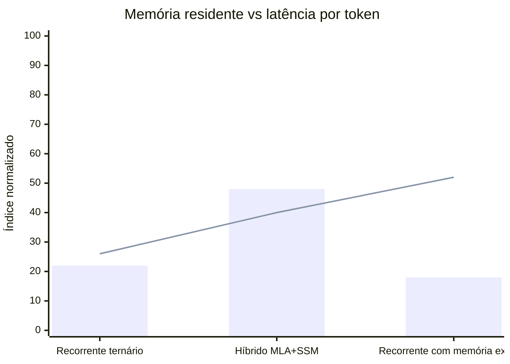
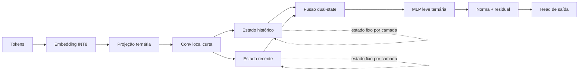
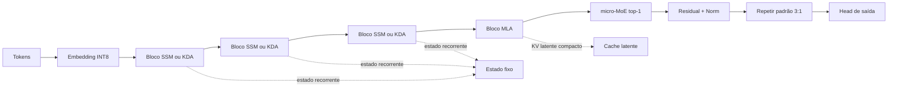
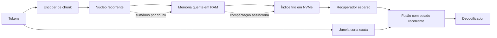
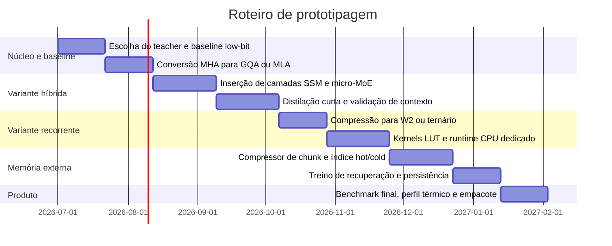

# Arquiteturas de IA sem dependência de GPU com pouca memória e alto desempenho prático

## Resumo executivo

A conclusão central é desagradavelmente simples, como quase toda verdade útil: não existe uma arquitetura de linguagem de alta qualidade que “ignore” completamente álgebra pesada, memória e largura de banda. O que existe, e já aparece no estado da arte, é uma combinação muito mais eficiente de quatro ideias: reduzir os bits por peso, eliminar ou comprimir drasticamente o KV cache, substituir atenção plena por mecanismos recorrentes ou lineares na maior parte das camadas, e preservar apenas uma fração pequena de atenção explícita para retenção associativa e recuperação pontual. FlashAttention e PagedAttention melhoram muito a eficiência de Transformers, mas não removem o crescimento estrutural do KV cache; por outro lado, Mamba, RWKV e RetNet mostram que estados recorrentes fixos podem reduzir radicalmente esse custo, embora modelos puramente lineares ou recorrentes ainda sofram em certos tipos de recall associativo e in-context learning. BitNet e T-MAC mostram, adicionalmente, que pesos ternários ou ultra-low-bit podem tornar CPU-only inference surpreendentemente competitiva em throughput e energia.

Dessas observações emerge uma recomendação objetiva. Para **melhor equilíbrio entre qualidade e viabilidade em hardware local** sem VRAM grande, a arquitetura mais promissora hoje é uma **híbrida com maioria de camadas SSM/linear-recurrent, minoria de camadas de atenção latente MLA, e micro-MoE controlado**, porque ela preserva parte da memória associativa do Transformer enquanto corta grande parte do custo de cache e largura de banda. Para **máxima eficiência energética e simplicidade de inferência em CPU**, a melhor aposta é uma **arquitetura recorrente ternária/1.58-bit**, inspirada em Mamba-2, RWKV e BitNet. Para **contexto muito longo em RAM limitada**, a melhor linha é um **núcleo recorrente pequeno com memória externa hierárquica**, no espírito de AHN e modelos chunkwise recurrent.

O ponto mais importante para a pergunta original é este: se o objetivo é **não depender de GPU nem de VRAM grande**, então tentar “otimizar o Transformer clássico até o fim” não é o melhor caminho. O caminho mais realista é mover o modelo para uma região diferente do espaço de projeto: **pesos residentes em RAM de sistema, recorrência com estado fixo, KV quase zero ou muito comprimido, kernels LUT/int2-int4-int8 sem dequantização, e atenção explícita apenas onde ela paga o aluguel**. Há base experimental para cada peça desse quebra-cabeça, inclusive conversão e upcycling de checkpoints Transformer já treinados para híbridos mais eficientes, muitas vezes com poucos bilhões de tokens adicionais em vez de repetir pré-treinos absurdos de trilhões de tokens.

Em termos de priorização prática, eu recomendaria esta ordem: **primeiro prototipar a variante híbrida MLA + SSM + micro-MoE**, porque ela oferece a melhor chance de preservar qualidade; **depois derivar uma versão ternária recorrente menor**, visando CPU puro e eficiência; **por fim adicionar memória externa comprimida**, para escalar contexto sem reintroduzir um inferno de KV cache. O resto é física e engenharia, não fé.

## Premissas, gargalos físicos e princípios de projeto

O gargalo dominante em LLMs autorregressivos modernos não é apenas FLOP bruto. No decode, o problema tende a ser **memory-bound**: pesos precisam ser lidos repetidamente, e em Transformers o KV cache cresce com o comprimento da sequência. Shazeer apontou isso ao propor MQA; FlashAttention atacou a movimentação entre HBM e SRAM; vLLM e PagedAttention atacaram fragmentação e desperdício no cache; mas todos esses trabalhos partem do mesmo diagnóstico: largura de banda e movimentação de memória importam tanto quanto, ou mais do que, o número cru de multiplicações.

Em paralelo, há uma segunda linha de ataque. SSMs e arquiteturas recorrentes modernas substituem a memória crescente do KV cache por um **estado fixo por camada**, o que torna o custo de memória por token muito mais previsível. Mamba reporta throughput de inferência até 5× maior que Transformers similares e escala linear com o comprimento da sequência; Mamba-2 surge como refinamento 2-8× mais rápido; RetNet descreve inferência recorrente de custo O(1) por passo; RWKV combina treinamento paralelizável com inferência ao estilo RNN. Ainda assim, a literatura mais cuidadosa mostra uma limitação: SSMs puros costumam sofrer em tarefas que exigem recuperação associativa muito precisa, o que motivou híbridos com pequena fração de camadas de atenção.

A terceira linha de ataque é reduzir a granularidade numérica. BitNet b1.58 mostra que pesos ternários nativos podem manter desempenho comparável a LLMs full-precision do mesmo tamanho, com vantagens relevantes em memória, energia e latência. T-MAC mostra que, em CPUs, operar diretamente sobre mpGEMM low-bit com tabelas de consulta, sem dequantização, produz ganhos de throughput e energia significativos. Em outras palavras, “evitar multiplicações pesadas” não significa abolir soma ponderada, o que seria pseudociência com estética de gambiarra, mas **substituir parte relevante do custo por lookup, bit-parallelism e acumulação mais barata**.

Daí seguem cinco princípios de projeto. Primeiro, **não usar atenção plena em todas as camadas**. Segundo, **usar pesos ultra-low-bit residentes em RAM**, e não streaming contínuo de camadas a partir de SSD. Terceiro, **minimizar ou eliminar KV cache** por recorrência, GQA ou MLA. Quarto, **reter uma minoria de camadas de atenção explícita** para não perder recall associativo. Quinto, **usar memória externa comprimida para contexto longo**, em vez de fingir que um cache crescente infinito vai caber para sempre em hardware doméstico.

Há, porém, dois gargalos que os cinco princípios acima não resolvem e que merecem destaque honesto. O primeiro é o **prefill**: tudo isto otimiza o *decode* (memory-bound), mas processar um prompt longo é dominado por *compute*, e CPU tem ordens de grandeza menos throughput de FLOPs que GPU. Mesmo com recorrência linear as constantes são grandes, e qualquer atenção residual (MLA/GQA) é quadrática na janela. Na prática, colar um documento de dezenas de milhares de tokens pode custar uma espera longa antes do primeiro token — o verdadeiro matador de UX em inferência local, e o eixo onde NPU/AMX para prefill deixam de ser "opcionais". O segundo é que **MoE economiza compute ativo, não footprint**: todos os especialistas precisam estar residentes (ou sofrer streaming), então micro-MoE ajuda banda e latência, mas não reduz a RAM ocupada — detalhe retomado na variante híbrida.

O gráfico abaixo resume, em escala normalizada, o trade-off esperado entre memória residente e latência por token das três variantes propostas neste relatório. Ele é uma síntese analítica baseada nos comportamentos observados em SSMs, híbridos MLA/linear e memória externa comprimida. **Os índices são qualitativos e ilustrativos — não são medições; mostram apenas a ordenação relativa esperada, não magnitudes reais.**

## Matriz comparativa do estado da arte relacionado

A tabela abaixo compara as famílias e sistemas mais relevantes para o problema, incluindo exatamente as linhas que você pediu e algumas que se tornaram impossíveis de ignorar em 2025-2026.

| Linha | Primitiva dominante | Estado e cache | O que melhora | O que não resolve | Relevância para a nova arquitetura | Fontes |
|---|---|---|---|---|---|---|
| Transformer denso | MACs densos FP16/BF16/INT8 | KV cresce com a sequência | Melhor recall associativo geral | Forte pressão de memória e banda no decode | Base de qualidade a ser parcialmente preservada | arXiv 1706.03762 |
| FlashAttention | Atenção exata com tiling IO-aware | Mesmo KV, menos IO interno | Acelera treino e inferência, especialmente em contextos longos | Não elimina a dependência estrutural do KV cache | Técnica útil, mas insuficiente sozinha para CPU-first | arXiv 2205.14135, 2307.08691 |
| vLLM PagedAttention | Gestão paginada de KV | KV paginado, menos fragmentação | 2-4× throughput em serving e quase zero desperdício de KV | Continua sendo um regime de KV crescente | Ideia útil para caches híbridos e prefix caching | arXiv 2309.06180 |
| llama.cpp | Runtime C/C++ low-bit | mmap, quantização, KV quantizado e offload | Torna viável inferência local em CPU e híbrida CPU+GPU | Não muda a arquitetura do modelo | Excelente base de runtime local | github.com/ggml-org/llama.cpp |
| MQA e GQA | Atenção com K/V compartilhados | KV menor por cabeça/grupo | Reduz banda e cache com pouca perda de qualidade | Continua havendo KV crescente | Bom bloco de atenção residual em híbridos | arXiv 1911.02150, 2305.13245 |
| MLA | Atenção latente de baixa dimensão | KV latente, compressão forte | DeepSeek-V2 reporta 93.3% menos KV e 5.76× throughput máximo; MHA2MLA reduziu KV do Llama2-7B em 92.19% com queda pequena em LongBench | Ainda existe atenção, embora muito mais barata | Melhor atenção residual para contexto longo em RAM limitada | arXiv 2405.04434, 2502.14837, 2502.07864 |
| MoE, Switch, Mixtral, DeepSeekMoE | Especialistas esparsos com roteamento | Pesos totais grandes, poucos ativos por token | Aumenta capacidade sem ativar todos os parâmetros | Roteamento e armazenamento total continuam caros; treinamento é instável se mal controlado | Útil apenas em versão micro-MoE e com top-1/top-2 | arXiv 2101.03961, 2401.04088, 2401.06066 |
| Jamba (híbrido Transformer-Mamba-MoE) | Maioria Mamba + poucos blocos de atenção + MoE | KV bem menor que Transformer denso | Primeiro híbrido SSM-atenção-MoE aberto em escala de produção | Ainda usa atenção; total de parâmetros grande | Arquétipo já em produção da variante híbrida | arXiv 2403.19887 |
| Mamba e Mamba-2 | SSM seletivo e scan recorrente | Sem KV; estado fixo | Throughput alto, escalabilidade linear, contexto muito longo | Puro SSM perde em certos benchmarks de recall associativo | Excelente espinha dorsal de inferência CPU-first | arXiv 2312.00752, 2405.21060 |
| RWKV | Recorrência linear com treino paralelizável | Sem KV clássico | Inferência eficiente tipo RNN | Sequencialidade e maturidade de tooling ainda contam | Bom candidato para aceleradores especializados e CPU puro | arXiv 2305.13048 |
| RetNet | Retention recorrente e chunkwise | Inferência O(1) por passo | Baixo custo de inferência, bom para chunking longo | Ecossistema menor que Transformer/Mamba | Forte inspiração para chunkwise recurrence | arXiv 2307.08621 |
| DeltaNet e Gated DeltaNet | Atenção linear com delta rule + gating | Estado fixo; sem KV | Recall associativo bem melhor que SSM/linear puro | Mais novo; tooling ainda em maturação | Base da KDA do Kimi Linear; forte candidato a núcleo recorrente | arXiv 2406.06484, 2412.06464 |
| Griffin / RecurrentGemma | Recorrência linear gated + atenção local | Estado fixo; sem KV global crescente | Modelo recorrente pequeno já lançado e aberto | Atenção local ainda presente; ecossistema menor | Prova de conceito shipped de "recorrência + janela curta" (variante A) | arXiv 2402.19427, 2404.07839 |
| BitNet b1.58 | Pesos ternários nativos | Baixíssimo footprint de pesos | Memória, energia e latência muito menores; CPU e GPU oficiais | Ecossistema ainda jovem e treinamento nativo exige receita específica | Melhor base para evitar MAC pesado em CPU | arXiv 2402.17764 |
| XNOR-Net e BinaryConnect | Operações binárias, XNOR/popcount | Pesos e ativações discretos | Elimina muita multiplicação, salva memória | Historicamente mais fortes em visão do que em LLMs; acurácia é sensível | Inspiração para kernels e co-design, não para copiar literalmente | arXiv 1603.05279, 1511.00363 |
| AHN | Janela lossless + memória comprimida recorrente | Curto prazo exato, longo prazo compacto | Reduz FLOPs e cache preservando desempenho em contexto longo | Mais complexo de treinar e validar | Melhor referência para substituir KV longo por memória comprimida de tamanho fixo | arXiv 2510.07318 |
| Titans | Memória neural de longo prazo aprendida em test-time | Memória recorrente profunda + atenção curta | Memoriza/esquece de forma adaptativa em tempo de teste | Custo de update em test-time; mais complexo | Referência central para a variante C, ao lado de AHN | arXiv 2501.00663 |

## Variante recorrente ternária

A primeira proposta é uma arquitetura **majoritariamente recorrente, sem atenção plena no caminho principal, com pesos ternários nativos e kernels LUT/bit-parallel em CPU**. Ela se apoia em quatro blocos já bem fundamentados: recorrência seletiva ao estilo Mamba/Mamba-2, inferência tipo RNN ao estilo RWKV/RetNet, pesos ternários ao estilo BitNet, e implementação CPU eficiente ao estilo T-MAC. O objetivo não é ganhar concurso de beleza teórica. O objetivo é caber em RAM normal, manter estado fixo e gerar tokens rápido sem pedir uma GPU como oferenda religiosa.

O bloco proposto fica assim:

A ideia de **dois estados por camada**, um mais conservador para histórico e outro mais volátil para recência, é inspirada diretamente em DSLA, que foi proposto justamente para reduzir o viés de atenção linear para os tokens mais recentes. Isso ataca um problema conhecido dos modelos lineares e recorrentes puros: eles tendem a comprimir demais a história antiga e a supervalorizar o que acabou de entrar.

### Componentes principais

| Componente | Primitiva | Função | Observação |
|---|---|---|---|
| Embedding e saída | INT8 ou FP16 compactado | Preservar qualidade lexical | Parte pequena do custo total |
| Projeções internas | ternário x INT8 com LUT | Reduzir MAC e bytes lidos | Segue a direção de BitNet e T-MAC |
| Mistura local | conv curta / shift / Hadamard | Capturar padrões próximos | Menos custosa que atenção |
| Memória longa | estado recorrente seletivo | Substitui KV cache global | Escala com número de camadas, não com contexto |
| Memória curta | segundo estado recorrente | Corrigir viés de recência | Inspirado em DSLA |
| MLP | ternário ou W2A8 | Capacidade adicional | Pode usar ReLU² ou gated MLP conforme BitNet-style |

### Orçamento estimado de recursos

Assumo aqui decode batch=1, CPU com SIMD decente, RAM DDR5 ou LPDDR5, e pesos já empacotados em formato nativo low-bit. Os números são **estimativas de engenharia**, não benchmarks publicados desta arquitetura exata. Uma ressalva de leitura: o throughput sobe do perfil compacto para o médio apenas porque o perfil médio assume **mais núcleos** (12-16 vs 8) — o modelo maior não fica "mais rápido"; a comparação justa é por núcleo, não entre as linhas.

| Perfil | Tamanho-alvo | Armazenamento | RAM residente | CPU | Acelerador opcional | NVMe | Throughput esperado |
|---|---|---:|---:|---|---|---|---:|
| compacto | 2.5B a 3B parâmetros ternários | 0.9 a 1.6 GB | 3 a 6 GB | 8 núcleos | AVX2/AVX512/AMX ou SVE2 | só carga inicial | 20 a 40 tok/s |
| médio | 4B a 5B parâmetros ternários | 1.5 a 2.8 GB | 6 a 10 GB | 12 a 16 núcleos | idem | só carga inicial | 30 a 60 tok/s |

Essas faixas são consistentes com o fato de que BitNet b1.58 reporta ganhos substanciais de memória, energia e latência frente a modelos equivalentes, enquanto T-MAC mostra 20 tok/s em um único núcleo e 48 tok/s em quatro núcleos para BitNet 3B em hardware móvel x86/ARM moderno, além de ganhos importantes para modelos 7B low-bit. Logo, uma arquitetura recorrente ainda mais “cache-light” tem boa chance de ficar nessa ordem de grandeza, desde que o runtime seja realmente LUT-native e não uma pilha que reconverte tudo para float porque a vida precisava de mais ironia.

### Como ela lida com memória, banda e contexto longo

Nesta variante, o **peso do modelo domina a RAM**; o estado recorrente por camada cresce pouco e o custo de contexto é quase constante por token, ao contrário do KV cache clássico. Em hardware doméstico, isso desloca o gargalo do “armazenar tudo que já foi visto” para “ler pesos low-bit rápido e atualizar estados pequenos”. Isso é exatamente o tipo de regime em que T-MAC, BitNet e kernels de lookup têm apelo.

Para contexto longo, a estratégia principal é **não ter KV**. Em vez disso, usa-se o par de estados recorrentes por camada e, opcionalmente, uma sumarização chunkwise ao estilo RetNet. Se for preciso manter alguma exatidão local, uma janela curta de 256 a 1024 tokens pode ser guardada em RAM como scratchpad, mas não como cache principal. Isso mantém a memória estável e a latência previsível.

### Estratégias de quantização e offload

A estratégia natural é **treinar ou converter para ternário nativo**, com ativações em 8 bits e algumas projeções críticas em 8 ou 16 bits. BitNet b1.58 e Bi-Mamba indicam que quantização extrema pode funcionar tanto em Transformers quanto em SSMs, desde que a receita de treinamento seja adequada. O runtime deveria usar empacotamento de pesos, tabelas de consulta, `mmap`, `mlock` quando possível, e evitar dequantização em tempo de execução.

Aqui, **streaming de camadas a partir de SSD** não é recomendável no decode normal. O SSD deve servir para carga inicial, checkpointing e talvez cold-start de versões maiores. Fazer layer streaming por token reintroduz a penalidade de I/O que esta arquitetura tenta justamente evitar.

### Treinamento e migração a partir de Transformers

Do ponto de vista de treinamento, esta variante é a mais agressiva. O caminho viável não é pré-treinar tudo do zero em CPU porque o universo não é uma fanfic. O caminho mais plausível é:

1. partir de um Transformer pequeno ou médio já bom;
2. converter/initializar camadas lineares e blocos compatíveis;
3. substituir gradualmente atenção por blocos recorrentes;
4. fazer distilação de logits e de features intermediárias;
5. aplicar QAT/treino low-bit nativo nas últimas fases.

TransMamba descreve weight sub-cloning e distilação bidirecional para transferir conhecimento de Transformer para Mamba; “The Mamba in the Llama” mostra destilação de Transformers grandes para híbridos lineares reutilizando projeções; HALO converte camadas de atenção de Transformers (ex.: Qwen3) em variantes lineares com orçamento de dados modesto. Para esta variante específica, eu usaria exatamente essa família de receitas, mas empurrando a quantização mais longe.

O risco principal é claro: **robustez e acurácia em tarefas de alta exigência associativa**. Pureza arquitetural é um vício caro. Se o caso de uso exige recuperação precisa de passagens distantes, código complexo ou raciocínio multi-hop sensível ao contexto, essa variante pode perder para a híbrida.

## Variante híbrida com atenção latente

A segunda proposta é, pragmaticamente, a melhor. Trata-se de uma arquitetura **híbrida em que a maioria das camadas é SSM/linear-recurrent e uma minoria periódica é MLA ou GQA**, com **micro-MoE** no lugar de MLP denso em parte das camadas. Ela nasce do consenso emergente entre várias linhas recentes: Mamba-2-Hybrid, Nemotron-H, Kimi Linear, HyLo, HALO, DSLA-Serve e TransMLA apontam que o “ponto ótimo” não é Transformer puro nem SSM puro, mas um híbrido onde poucos blocos de atenção fazem o trabalho que a recorrência sozinha ainda faz mal.

A macroarquitetura proposta é esta:

O padrão 3:1 é deliberado. Kimi Linear relata exatamente uma hibridização nessa ordem e mostra redução de até 75% no uso de KV cache e até 6.3× de aceleração de decode em 1M tokens, ao mesmo tempo em que supera a alternativa full-MLA na avaliação reportada. Em outra frente, o estudo empírico de Mamba-based LMs mostra que um híbrido 8B com apenas 4 camadas de atenção em 56 camadas totais, ou 7.1% de atenção, pode igualar ou superar Transformers em vários benchmarks depois de treino suficiente. Nemotron-H segue a mesma lógica e reporta até 3× mais rapidez de inferência para uma dada faixa de acurácia.

### Componentes principais

| Componente | Primitiva | Função | Observação |
|---|---|---|---|
| Backbone majoritário | Mamba-2, KDA ou DSLA | Mistura de longo alcance com estado fixo | Sem KV global |
| Camadas residuais de atenção | MLA preferencialmente, GQA como fallback | Recuperação associativa e in-context learning | KV comprimido ou reduzido |
| FFN esparso | micro-MoE top-1 ou top-2 | Aumentar capacidade com menor compute ativo | Não usar MoE gigante localmente |
| Quantização | W4 para especialistas, W2/W4/ternário no backbone | Reduz RAM e banda | Mistura seletiva por sensibilidade |
| Decoding extra | assisted/self-speculative opcional | Subir throughput sem mudar saída | Útil quando o verificador cabe em RAM |

### Orçamento estimado de recursos

| Perfil | Tamanho-alvo | Armazenamento | RAM residente | CPU | Acelerador opcional | NVMe | Throughput esperado |
|---|---|---:|---:|---|---|---|---:|
| compacto | 6B total, 1.5B a 2B ativos por token | 4 a 7 GB | 12 a 24 GB | 8 a 12 núcleos | NPU ou AMX para prefill | útil para cold-start | 6 a 12 tok/s |
| principal | 8B a 10B total, 2B a 3B ativos por token | 6 a 12 GB | 20 a 40 GB | 12 a 16 núcleos | NPU/AMX/FPGA leve | útil para experts frios | 12 a 22 tok/s |

Essas faixas refletem um compromisso realista. Elas são ancoradas no fato de que híbridos recentes preservam desempenho melhor que SSMs puros, MLA comprime muito o KV cache, e micro-MoE aumenta capacidade sem ativar todos os parâmetros. Mas, ao contrário da variante recorrente pura, aqui ainda existe alguma atenção. Portanto a latência por token sobe e a eficiência energética cai um pouco. Em compensação, a robustez cognitiva melhora de forma material.

### Como ela lida com KV, banda e contexto longo

A camada de atenção residual deve usar **MLA** sempre que possível. DeepSeek-V2 descreve compressão do KV em vetor latente com redução de 93.3% no cache e aumento forte de throughput; MHA2MLA mostra que checkpoints tradicionais podem ser adaptados a MLA com uma fração muito pequena do dado original (sub-1%), reduzindo o KV do Llama2-7B em 92.19% com queda mínima em LongBench. Se o stack de inferência não suportar MLA com boa eficiência em CPU logo no início, GQA é o plano B pragmático.

Para contexto muito longo, a arquitetura deve combinar três níveis de memória. O primeiro é **estado recorrente fixo** nas camadas SSM. O segundo é **KV latente apenas nas camadas MLA**, idealmente quantizado. O terceiro é um mecanismo de **prefix caching e chunked prefill** emprestado do ecossistema vLLM, ainda que o runtime final seja CPU-first. Em outras palavras, você não precisa carregar a religião inteira do vLLM; basta roubar as boas ideias como um adulto funcional.

### Estratégias de quantização e streaming

A regra aqui é heterogênea. Backbone SSM em **W2/W4 ou ternário**, atenção residual em **W4/W8**, embeddings e alguns normalizadores em **INT8/FP16**, e KV latente em **INT4** quando a latência permitir. O guia de cache da Hugging Face documenta que cache quantizado reduz memória, mas pode piorar a latência em contextos curtos; portanto a quantização do KV deve ser adaptativa, ativa só acima de certo comprimento de contexto.

Quanto a streaming, o projeto deve **evitar offload fino por token**. Experts frios podem ser pré-buscados em fronteiras de chunk ou sessão; não devem ser pescados do NVMe a cada passo de decode, porque isso destrói a vantagem do sparse compute. Offload razoável aqui é: pesos residentes em RAM; cache residual, experts raros ou memórias de sessão em NVMe; prefetch assíncrono; e zero heroísmo místico com layer streaming contínuo. Essa recomendação segue a literatura de offload, que consistentemente mostra trade-off entre memória e throughput quando estados precisam ir e voltar entre dispositivos ou hierarquias.

Uma ressalva honesta sobre o micro-MoE: o roteamento de especialistas é **por token** (top-1/top-2), não estável por chunk, então "pré-buscar experts em fronteiras de chunk" só funciona se o roteamento for, na prática, muito estável — caso contrário você volta a pescar pesos do NVMe a cada passo, justamente o que se quer evitar. O caminho seguro é manter **todos os experts residentes em RAM** (em low-bit) e reservar o NVMe para experts genuinamente raros ou memórias de sessão. Em outras palavras, o micro-MoE aqui compra **compute e banda**, não **footprint**. Stacks como ktransformers mostram que offload de experts MoE pode funcionar, mas tipicamente apoiados em GPU para a atenção — fora do regime CPU-puro que este documento defende.

### Treinamento e migração a partir de Transformers

Esta é a variante com melhor caminho de migração. O pipeline mais sólido é:

1. **MHA para GQA** por mean pooling de cabeças e uptraining leve;
2. **GQA para MLA** com TransMLA ou MHA2MLA;
3. substituição de 70%-90% das camadas de atenção por **Mamba-2, KDA ou DSLA**;
4. distilação de logits e features por 2B-10B tokens;
5. extensão de contexto com curriculum e posição híbrida.

Há respaldo forte para isso. HALO converte camadas de atenção do Qwen3 para variantes lineares — embora o próprio paper relate que **nem toda conversão converge** (a conversão para KDA falhou no Qwen3-1.7B, e Lightning Attention deu o melhor equilíbrio), então não trate isso como botão mágico; o estudo de 8B Mamba-2-Hybrid mostra que 7.1% de atenção pode bastar; DSLA-Serve mostra substituição adaptativa com 2.3× sobre Llama2-7B e 3× sobre Zamba-7B; Nemotron-H reporta híbridos melhores ou comparáveis a Transformers abertos similares com inferência até 3× mais rápida. *(A alegação "HyLo estende contexto em 32× e reduz KV >90%" não pôde ser confirmada em fonte primária — verificar antes de citar.)*

O risco principal desta variante é a complexidade de implementação. É a melhor opção tecnicamente, mas também a mais fácil de estragar com um runtime ruim. Se o kernel de MLA, o roteamento do micro-MoE e a quantização heterogênea não forem muito bem integrados, ela vira uma tese ambulante sobre overhead. Ainda assim, é a variante mais promissora para **qualidade forte sem GPU**.

## Variante recorrente com memória externa

A terceira proposta é a mais interessante para **contextos enormes em máquinas comuns**. Em vez de tentar carregar toda a história em KV ou comprimi-la brutalmente em um único estado, ela usa um **núcleo recorrente pequeno** como memória operacional e uma **memória externa hierárquica** em RAM e NVMe para história consolidada. Esse conceito é diretamente alinhado com AHN, que combina uma janela lossless curta com uma memória de longo prazo comprimida por um módulo recorrente, reduzindo FLOPs e cache sem perder tanto desempenho de longo contexto. **Vale separar duas ideias que esta variante mistura:** *(a)* compressão recorrente do fora-da-janela em estado de **tamanho fixo** — é o que AHN e Titans fazem, e não é retrieval; e *(b)* uma memória **crescente** hot/cold com recuperação esparsa por chunk — isso pertence à linhagem de kNN-LM, Memorizing Transformers, RETRO e Unlimiformer. São mecanismos distintos e complementares; o desenho abaixo é um híbrido dos dois, mas apenas a parte (a) é sustentada por AHN.

A arquitetura fica assim:

A contribuição desta variante, em relação a AHN puro, é empurrar a memória para uma hierarquia explícita: **RAM quente para sessões recentes e NVMe para histórico frio**, com recuperação esparsa por chunk, não por token. Convém ser honesto sobre a originalidade: essa hierarquia hot/cold com recuperação é, no fundo, engenharia de RAG — a linhagem kNN-LM / Memorizing Transformers / RETRO já fazia memória externa recuperável; o que AHN/Titans acrescentam é a *compressão recorrente* do que sai da janela. A combinação é útil, mas não é inédita. Isso troca um crescimento linear fino por um crescimento em unidades muito maiores e mais fáceis de indexar. A intuição é quase ofensivamente pragmática: guardar cada token para sempre é caro; guardar resumos, chaves semânticas e estados de consolidação é muito menos caro. AHN mostra que essa lógica pode preservar qualidade; a extensão aqui é torná-la também amigável a hardware local e a sessões longas persistentes.

### Componentes principais

| Componente | Primitiva | Função | Observação |
|---|---|---|---|
| Janela curta | atenção local ou MLA curta | precisão recente | 256 a 2048 tokens |
| Núcleo central | Mamba-2, GDN ou DSLA pequeno | processamento contínuo | estado fixo |
| Compressão de chunk | encoder recorrente | consolidar blocos da história | gera slots/sumários |
| Memória quente | RAM | histórico recente comprimido | baixa latência |
| Memória fria | NVMe | histórico antigo comprimido | alta capacidade |
| Recuperação | busca esparsa por chunk | reidratar contexto relevante | evita KV token-a-token |

### Orçamento estimado de recursos

| Perfil | Núcleo | Armazenamento do modelo | Armazenamento de memória | RAM | CPU | NVMe | Throughput esperado |
|---|---|---:|---:|---:|---|---|---:|
| local leve | 1.5B a 2B recorrente | 1 a 3 GB | 10 a 50 GB | 8 a 16 GB | 8 núcleos | 3 GB/s ou mais | 12 a 25 tok/s |
| local robusto | 2.5B a 3B recorrente | 2 a 5 GB | 50 a 200 GB | 16 a 32 GB | 12 a 16 núcleos | 5 a 7 GB/s | 15 a 30 tok/s sem retrieval denso; 8 a 20 tok/s com retrieval frequente |

O throughput cai quando há muita recuperação, mas continua razoável porque a recuperação é feita **por chunk**, não a cada token. Essa arquitetura é a única das três que pode tratar **contexto muito longo** em hardware comum sem depender de KV crescente ou de quantização cada vez mais desesperada — "muito longo", não "ilimitado": o orçamento fixo de recuperação (4-16 chunks) e o estado recorrente lossy impõem um teto real de fidelidade; o que cresce sem limite é o *armazenamento*, não a capacidade de *lembrar com precisão*. Ela é especialmente boa para agentes, sessões persistentes, análise documental longa e memória de usuário.

### Como ela trata contexto longo

A melhor referência aqui é AHN. O paper mantém uma janela de atenção lossless curta e comprime o que sai dessa janela para um estado fixo; em Qwen2.5-3B-Instruct, a versão AHN reportada reduz FLOPs em 40.5% e memory cache em 74.0% no benchmark citado, com melhora de score médio em LV-Eval 128k usando apenas +0.4% de parâmetros. Isso é exatamente o tipo de direção que faz sentido para CPU/RAM doméstica: **manter precisão no que é recente, consolidar o resto em memória compacta**.

Minha extensão proposta é usar dois níveis dessa memória compacta. A memória quente em RAM retém os últimos milhares de chunks consolidados; a memória fria em NVMe armazena o histórico antigo em formato append-only, com índices compactos. O decodificador consulta ambos sob uma política de orçamento fixo, por exemplo 4-16 chunks por evento de recuperação. Isso mantém o custo de banda controlado e evita o fracasso clássico de “offload” mal desenhado, onde o SSD vira coautor de cada token gerado. A parte “compressão recorrente de contexto fora da janela em memória fixa” é diretamente suportada por AHN (e por Titans, que aprende essa memória em test-time). A parte “NVMe hierárquico hot/cold” não é inédita — é a mesma ideia de memória externa recuperável de kNN-LM, Memorizing Transformers e RETRO, aqui apenas adaptada a disco local e sessões persistentes.

### Quantização, streaming e robustez

O núcleo recorrente deve usar a mesma filosofia da variante A: pesos em W2/W4 ou ternário, estado pequeno e residente, e zero streaming de camadas. O que faz streaming aqui não são as camadas do modelo, e sim os **slots de memória externa**. Isso é muito mais barato, porque slots comprimidos e embeddings sumarizados são ordens de grandeza menores do que carregar várias camadas inteiras por token.

O compromissso é robustez semântica. Essa variante provavelmente será excelente para histórico persistente, mas inferior à híbrida MLA+SSM quando a tarefa pedir extração exata de dependências arbitrárias muito finas entre tokens distantes. A maneira de compensar isso é manter uma **janela lossless curta não-negociável** e treinar a compressão com auto-distilação e perdas explícitas de recuperação. Essa lógica também aparece em AHN, cujo treino congela o modelo base e otimiza só o módulo de memória comprimida.

### Treinamento e migração

O caminho mais plausível aqui é quase o oposto do pré-treino completo. Começa-se com um backbone aberto forte, congela-se a maior parte do modelo, e treina-se apenas o compressor de memória e o recuperador, usando auto-distilação sobre tarefas de contexto longo. AHN faz exatamente isso: congela os pesos do modelo base e otimiza só a memória artificial. Para um sistema orientado a uso local, isso é ouro, porque desloca o custo de treinamento para um componente pequeno.

Por isso, esta variante é a melhor candidata quando o requisito principal é **contexto longo com baixo custo de adaptação**, não necessariamente a máxima qualidade generalista em benchmark curto. Ela é menos “fundação universal” e mais “motor de memória utilizável”. Honestamente, isso é uma vantagem na maioria dos produtos locais.

## Viabilidade, software stack e roteiro de prototipagem

A tabela a seguir sintetiza o trade-off entre as três variantes nos eixos que você pediu.

| Dimensão | Recorrente ternária | Híbrida MLA + SSM + micro-MoE | Recorrente com memória externa |
|---|---|---|---|
| Primitiva de compute | LUT, ternário, INT8, recorrência | mistura de recorrência, MLA e sparse experts | recorrência + retrieval por chunk |
| Dependência de MAC pesado | baixa | média | baixa |
| Footprint de pesos | muito baixo | médio | baixo |
| KV cache | inexistente ou mínimo | baixo a médio, comprimido | curto e local |
| Ativações | baixas | médias | baixas |
| Largura de banda | dominada por leitura low-bit dos pesos | dividida entre pesos, MLA e experts | dividida entre pesos e retrieval |
| Latência por token | melhor | intermediária | pior em retrieval pesado |
| Eficiência energética | melhor | boa | boa, mas dependente de I/O |
| Escalabilidade local | excelente | boa | excelente para contexto longo |
| Complexidade de treino | alta | média | média a baixa na adaptação |
| Capacidade do modelo | média | alta | média |
| Robustez e recall | média | melhor | média a boa, se treinamento de memória for forte |
| Precisão esperada | boa | melhor | dependente do domínio |
| Melhor uso | edge CPU puro | assistente geral local | memória persistente e docs longos |

Essa síntese bate com a literatura recente: híbridos tendem a fechar a lacuna de qualidade dos SSMs puros; MLA/GQA comprimem bem o custo residual de atenção; e low-bit LUT kernels são hoje a forma mais convincente de tornar CPUs novamente relevantes para inferência local.

### Software stack necessário

Para **inferência local**, o stack mínimo mais plausível é um runtime C/C++ no estilo `llama.cpp` ou `bitnet.cpp`, com kernels low-bit nativos e suporte a `mmap`, pinagem de memória, empacotamento de pesos e quantização de cache quando houver atenção residual. `llama.cpp` já oferece inferência local low-bit em uma variedade enorme de hardwares e suporta `mmap`, KV de baixa precisão e inferência híbrida CPU+GPU; `bitnet.cpp` é a referência oficial para 1-bit/1.58-bit; T-MAC já foi integrado para acelerar prefill low-bit.

Para **serving e engenharia de cache**, o ecossistema de `vLLM` continua relevante como referência arquitetural, principalmente por PagedAttention, prefix caching, chunked prefill e gestão de pools de KV. Ainda que o código seja, na prática, muito orientado a GPU, os conceitos são úteis e portáveis para um stack CPU-first com atenção residual esparsa.

Para **treinamento**, o stack prototípico deve ser PyTorch com kernels customizados para SSM/linear attention e distilação. A história recente mostra que o caminho economicamente sensato é o de **upcycling e distilação**, não o de recomeçar do zero. HALO, HyLo, TransMamba, MHA2MLA e “The Mamba in the Llama” formam um menu bem coerente para isso.

### Receita de treinamento recomendada

A melhor receita comum às três variantes é esta. Primeiro, usar um **teacher Transformer** forte e relativamente pequeno a médio, porque checkpoints abertos e maduros ainda concentram a melhor qualidade de base. Segundo, aplicar **conversão estrutural gradual**, não amputação brusca. Terceiro, usar **distilação de logits e camadas internas**, porque só distilar logits costuma ser insuficiente em troca de arquitetura. Quarto, fazer **curriculum de contexto longo** depois da conversão, não antes. Quinto, empurrar quantização extrema para o fim do processo, salvo quando se optar por treinamento ternário nativo estilo BitNet.

Na prática, isso se traduz em: perda de próxima palavra por entropia cruzada como objetivo principal; KL de distilação nos logits; matching de hidden states em camadas selecionadas; eventualmente losses auxiliares de recuperação para memória externa; AdamW ou otimizador similar na fase de adaptação; e QAT ou low-bit-aware finetuning nas fases finais. A literatura de conversão de Transformer para Mamba/híbridos e de treinamento low-bit dá suporte forte a esse desenho.

### Juízo de viabilidade

Se o objetivo é **algo implantável em 2026 em hardware local normal**, a avaliação é a seguinte. A **variante híbrida MLA + SSM + micro-MoE** é a mais viável para produto geral. A **variante recorrente ternária** é a melhor para edge e eficiência radical. A **variante com memória externa** é a melhor para sessões persistentes, documentos longos e assistentes pessoais locais. Tentar treinar do zero um modelo realmente grande sem aceleradores ainda é pouco realista, mas **adaptar e servir** essas arquiteturas sem GPU grande é plausível e bem melhor suportado hoje do que era há dois anos.

O cronograma abaixo segue a rota com menor risco técnico: primeiro validar a versão híbrida, depois extrair uma versão recorrente mais extrema, e por fim acoplar memória externa.

A recomendação final, sem perfume e sem teatro, é esta: **construa um híbrido com backbone recorrente, atenção latente rara, quantização agressiva, e trate contexto longo como problema de memória hierárquica, não como acumulação infinita de KV**. É a direção mais sólida no estado da arte para fugir de VRAM grande sem jogar desempenho pela janela.

## Referências

> As citações originais deste documento eram tokens internos de ferramenta (`cite…turn…`) que não resolvem para nada. Foram substituídas por esta lista, com IDs do arXiv verificados em 2026-06. Uma alegação não pôde ser confirmada em fonte primária e está marcada como tal.

**Atenção e KV cache**
- *Attention Is All You Need* — arXiv 1706.03762
- *FlashAttention* — arXiv 2205.14135; *FlashAttention-2* — arXiv 2307.08691
- *Efficient Memory Management for LLM Serving with PagedAttention* (vLLM) — arXiv 2309.06180
- *Fast Transformer Decoding* (MQA) — arXiv 1911.02150; *GQA* — arXiv 2305.13245
- *DeepSeek-V2* (origem da MLA) — arXiv 2405.04434
- *Towards Economical Inference* (MHA2MLA) — arXiv 2502.14837 (ACL 2025); KV do Llama2-7B −92.19%, recuperação com <1% do dado original
- *TransMLA: Multi-Head Latent Attention Is All You Need* — arXiv 2502.07864

**SSM / recorrência / atenção linear**
- *Mamba* — arXiv 2312.00752; *Mamba-2 (Transformers are SSMs)* — arXiv 2405.21060
- *RWKV* — arXiv 2305.13048
- *RetNet (Retentive Network)* — arXiv 2307.08621
- *Parallelizing Linear Transformers with the Delta Rule* (DeltaNet) — arXiv 2406.06484; *Gated Delta Networks* — arXiv 2412.06464 (ICLR 2025)
- *Griffin* — arXiv 2402.19427; *RecurrentGemma* — arXiv 2404.07839
- *On-the-Fly Adaptive Distillation to Dual-State Linear Attention* (DSLA) — arXiv 2506.09316 (ICML 2025); origem do design dual-state (estado de histórico + estado de recência)

**Híbridos SSM + atenção (+ MoE)**
- *Jamba: A Hybrid Transformer-Mamba Language Model* — arXiv 2403.19887
- *An Empirical Study of Mamba-based Language Models* (Mamba-2-Hybrid 8B; 4 de 56 camadas = 7.1% de atenção) — arXiv 2406.07887
- *Nemotron-H* — arXiv 2504.03624
- *Kimi Linear* (KDA; híbrido 3:1; −75% KV; 6.3× TPOT vs MLA @1M tokens) — arXiv 2510.26692
- *Mixtral of Experts* — arXiv 2401.04088; *Switch Transformer* — arXiv 2101.03961; *DeepSeekMoE* — arXiv 2401.06066

**Quantização extrema / kernels low-bit em CPU**
- *The Era of 1-bit LLMs* (BitNet b1.58) — arXiv 2402.17764; runtime oficial: github.com/microsoft/BitNet
- *Bi-Mamba: Towards Accurate 1-Bit State Space Models* — arXiv 2411.11843
- *T-MAC: CPU Renaissance via Table Lookup* — arXiv 2407.00088 (até 4× throughput e −70% energia vs llama.cpp); github.com/microsoft/T-MAC
- *XNOR-Net* — arXiv 1603.05279; *BinaryConnect* — arXiv 1511.00363
- *llama.cpp* — github.com/ggml-org/llama.cpp

**Conversão / destilação Transformer → híbrido**
- *The Mamba in the Llama* — arXiv 2408.15237 (NeurIPS 2024)
- *TransMamba: Fast Universal Architecture Adaption from Transformers to Mamba* — arXiv 2502.15130 (técnica de weight sub-cloning + distilação bidirecional; validada em backbones de visão/multimodais, não em LLM — aplicar a texto é extrapolação)
- *HALO / Hybrid Linear Attention Done Right* — arXiv 2601.22156 (converte camadas do Qwen3; o próprio paper relata que nem toda conversão converge)
- *HyLo* — **não confirmado em fonte primária**; a alegação "32× de contexto, −90% KV" precisa ser verificada antes de citar

**Memória externa / contexto longo**
- *Artificial Hippocampus Networks* (AHN) — arXiv 2510.07318 (Qwen2.5-3B-Instruct: −40.5% FLOPs, −74% cache, LV-Eval 128k 4.41→5.88; instanciado com Mamba2/DeltaNet/Gated DeltaNet)
- *Titans: Learning to Memorize at Test Time* — arXiv 2501.00663
- *Generalization through Memorization* (kNN-LM) — arXiv 1911.00172
- *Memorizing Transformers* — arXiv 2203.08913
- *Improving Language Models by Retrieving from Trillions of Tokens* (RETRO) — arXiv 2112.04426
